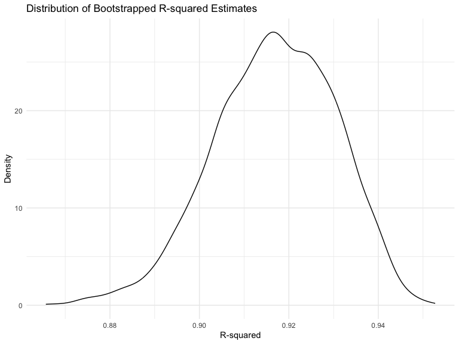
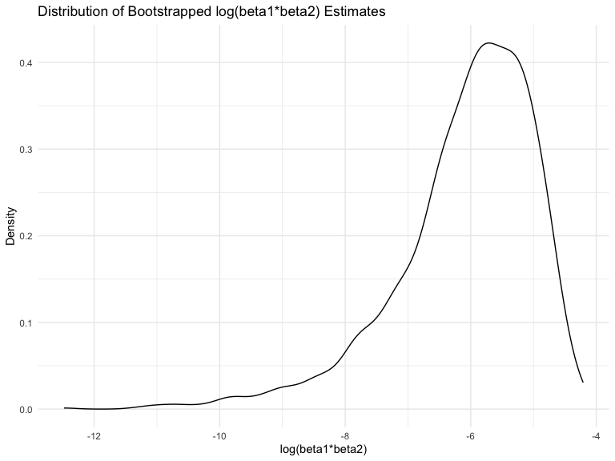
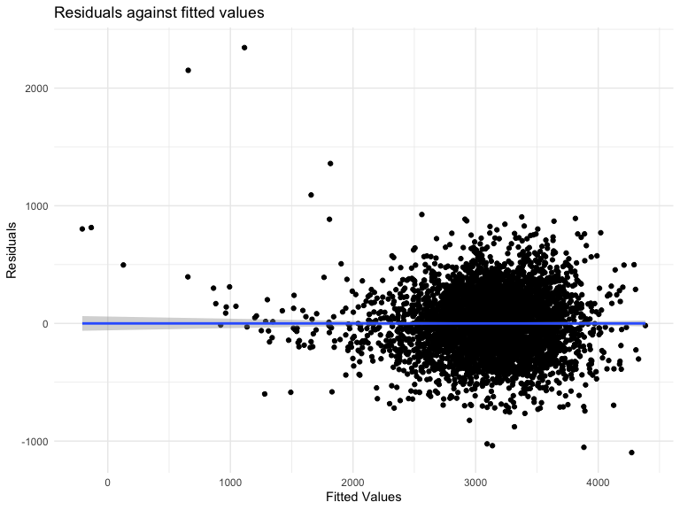
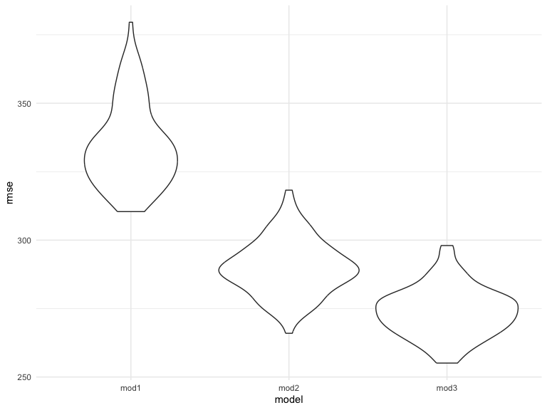

p8105_hw6_jl6647
================
Jiatong Li
2023-11-18

``` r
library(tidyverse)
```

    ## ── Attaching core tidyverse packages ──────────────────────── tidyverse 2.0.0 ──
    ## ✔ dplyr     1.1.3     ✔ readr     2.1.4
    ## ✔ forcats   1.0.0     ✔ stringr   1.5.0
    ## ✔ ggplot2   3.4.3     ✔ tibble    3.2.1
    ## ✔ lubridate 1.9.2     ✔ tidyr     1.3.0
    ## ✔ purrr     1.0.2     
    ## ── Conflicts ────────────────────────────────────────── tidyverse_conflicts() ──
    ## ✖ dplyr::filter() masks stats::filter()
    ## ✖ dplyr::lag()    masks stats::lag()
    ## ℹ Use the conflicted package (<http://conflicted.r-lib.org/>) to force all conflicts to become errors

``` r
library(dplyr)
library(broom)
library(boot)
library(modelr)
```

    ## 
    ## Attaching package: 'modelr'
    ## 
    ## The following object is masked from 'package:broom':
    ## 
    ##     bootstrap

``` r
library(mgcv)
```

    ## Loading required package: nlme
    ## 
    ## Attaching package: 'nlme'
    ## 
    ## The following object is masked from 'package:dplyr':
    ## 
    ##     collapse
    ## 
    ## This is mgcv 1.9-0. For overview type 'help("mgcv-package")'.

``` r
library(readxl)
library(purrr)

knitr::opts_chunk$set(
    echo = TRUE,
    warning = FALSE,
    fig.width = 8, 
  fig.height = 6,
  out.width = "90%"
)

options(
  ggplot2.continuous.colour = "viridis",
  ggplot2.continuous.fill = "viridis"
)

scale_colour_discrete = scale_colour_viridis_d
scale_fill_discrete = scale_fill_viridis_d

theme_set(theme_minimal() + theme(legend.position = "bottom"))
```

Problem 1

In the data cleaning code below we create a `city_state` variable,
change `victim_age` to numeric, modifiy victim_race to have categories
white and non-white, with white as the reference category, and create a
`resolution` variable indicating whether the homicide is solved. Lastly,
we filtered out the following cities: Tulsa, AL; Dallas, TX; Phoenix,
AZ; and Kansas City, MO; and we retained only the variables
`city_state`, `resolution`, `victim_age`, `victim_sex`, and
`victim_race`.

``` r
homicide_df = 
  read_csv("homicide-data.csv", na = c("", "NA", "Unknown")) |> 
  mutate(
    city_state = str_c(city, state, sep = ", "),
    victim_age = as.numeric(victim_age),
    resolution = case_when(
      disposition == "Closed without arrest" ~ 0,
      disposition == "Open/No arrest"        ~ 0,
      disposition == "Closed by arrest"      ~ 1)
  ) |> 
  filter(victim_race %in% c("White", "Black")) |> 
  filter(!(city_state %in% c("Tulsa, AL", "Dallas, TX", "Phoenix, AZ", "Kansas City, MO"))) |> 
  select(city_state, resolution, victim_age, victim_sex, victim_race)
```

    ## Rows: 52179 Columns: 12
    ## ── Column specification ────────────────────────────────────────────────────────
    ## Delimiter: ","
    ## chr (8): uid, victim_last, victim_first, victim_race, victim_sex, city, stat...
    ## dbl (4): reported_date, victim_age, lat, lon
    ## 
    ## ℹ Use `spec()` to retrieve the full column specification for this data.
    ## ℹ Specify the column types or set `show_col_types = FALSE` to quiet this message.

Next we fit a logistic regression model using only data from Baltimore,
MD. We model `resolved` as the outcome and `victim_age`, `victim_sex`,
and `victim_race` as predictors. We save the output as `baltimore_glm`
so that we can apply `broom::tidy` to this object and obtain the
estimate and confidence interval of the adjusted odds ratio for solving
homicides comparing non-white victims to white victims.

``` r
baltimore_glm = 
  filter(homicide_df, city_state == "Baltimore, MD") |> 
  glm(resolution ~ victim_age + victim_sex + victim_race, family = binomial(), data = _)

baltimore_glm |> 
  broom::tidy() |> 
  mutate(
    OR = exp(estimate), 
    OR_CI_upper = exp(estimate + 1.96 * std.error),
    OR_CI_lower = exp(estimate - 1.96 * std.error)) |> 
  filter(term == "victim_sexMale") |> 
  select(OR, OR_CI_lower, OR_CI_upper) |>
  knitr::kable(digits = 3)
```

|    OR | OR_CI_lower | OR_CI_upper |
|------:|------------:|------------:|
| 0.426 |       0.325 |       0.558 |

Below, by incorporating `nest()`, `map()`, and `unnest()` into the
preceding Baltimore-specific code, we fit a model for each of the
cities, and extract the adjusted odds ratio (and CI) for solving
homicides comparing non-white victims to white victims. We show the
first 5 rows of the resulting dataframe of model results.

``` r
model_results = 
  homicide_df |> 
  nest(data = -city_state) |> 
  mutate(
    models = map(data, \(df) glm(resolution ~ victim_age + victim_sex + victim_race, 
                             family = binomial(), data = df)),
    tidy_models = map(models, broom::tidy)) |> 
  select(-models, -data) |> 
  unnest(cols = tidy_models) |> 
  mutate(
    OR = exp(estimate), 
    OR_CI_upper = exp(estimate + 1.96 * std.error),
    OR_CI_lower = exp(estimate - 1.96 * std.error)) |> 
  filter(term == "victim_sexMale") |> 
  select(city_state, OR, OR_CI_lower, OR_CI_upper)

model_results |>
  slice(1:5) |> 
  knitr::kable(digits = 3)
```

| city_state      |    OR | OR_CI_lower | OR_CI_upper |
|:----------------|------:|------------:|------------:|
| Albuquerque, NM | 1.767 |       0.831 |       3.761 |
| Atlanta, GA     | 1.000 |       0.684 |       1.463 |
| Baltimore, MD   | 0.426 |       0.325 |       0.558 |
| Baton Rouge, LA | 0.381 |       0.209 |       0.695 |
| Birmingham, AL  | 0.870 |       0.574 |       1.318 |

Below we generate a plot of the estimated ORs and CIs for each city,
ordered by magnitude of the OR from smallest to largest. From this plot
we see that most cities have odds ratios that are smaller than 1,
suggesting that crimes with male victims have smaller odds of resolution
compared to crimes with female victims after adjusting for victim age
and race. This disparity is strongest in New yrok. In roughly half of
these cities, confidence intervals are narrow and do not contain 1,
suggesting a significant difference in resolution rates by sex after
adjustment for victim age and race.

``` r
model_results |> 
  mutate(city_state = fct_reorder(city_state, OR)) |> 
  ggplot(aes(x = city_state, y = OR)) + 
  geom_point() + 
  geom_errorbar(aes(ymin = OR_CI_lower, ymax = OR_CI_upper)) + 
  theme(axis.text.x = element_text(angle = 90, hjust = 1))
```


Problem 2

``` r
weather_df = 
  rnoaa::meteo_pull_monitors(
    c("USW00094728"),
    var = c("PRCP", "TMIN", "TMAX"), 
    date_min = "2022-01-01",
    date_max = "2022-12-31") |>
  mutate(
    name = recode(id, USW00094728 = "CentralPark_NY"),
    tmin = tmin / 10,
    tmax = tmax / 10) |>
  select(name, id, everything())
```

    ## using cached file: /Users/denglunlaopoyeyeye/Library/Caches/org.R-project.R/R/rnoaa/noaa_ghcnd/USW00094728.dly

    ## date created (size, mb): 2023-10-17 14:50:07.395932 (8.534)

    ## file min/max dates: 1869-01-01 / 2023-10-31

### bootstrap function

``` r
set.seed(1)
boot_sample = function(weather_df) {
  sample_n(weather_df, size = nrow(weather_df), replace = TRUE)
}
```

### 5000 bootstrap samples

``` r
boot_strap = weather_df |>  
  modelr::bootstrap(n = 5000) |> 
  mutate(
    mods = map(strap, ~lm(tmax ~ tmin + prcp, data = .x)),
    mods_beta = map(mods, broom::glance),
    mods_r2 = map(mods, broom::tidy)) |> 
  unnest(mods_r2, mods_beta) |> 
  dplyr::select(.id, term, estimate, r.squared) |> 
  pivot_wider(names_from = term, values_from = estimate) |> 
  rename(
    beta_0 = `(Intercept)`,
    beta_1 = tmin,
    beta_2 = prcp) 

res = boot_strap |> 
  summarise(r.squared = r.squared,
    log_beta12 = log(beta_1 * beta_2),
    log_beta01 = log(beta_0 * beta_1))
```

### CI for r-squared and log

``` r
# calculate CI for r-squared and log
r2_ci = 
  quantile(pull(res,r.squared), probs = c(0.025,0.975)) |> 
  knitr::kable()

log_ci = 
  quantile(pull(res,log_beta01), probs = c(0.025,0.975)) |>  
  knitr::kable()
  
r2_ci
```

|       |         x |
|:------|----------:|
| 2.5%  | 0.8885495 |
| 97.5% | 0.9406812 |

``` r
log_ci
```

|       |        x |
|:------|---------:|
| 2.5%  | 2.055008 |
| 97.5% | 2.138300 |

### Distribution Plots

``` r
r2_dist = res |> 
  ggplot(aes(x = r.squared)) +
  geom_density() +
  labs(title = "Distribution of Bootstrapped R-squared Estimates", x = "R-squared", y = "Density")
r2_dist
```



This plot is a density plot of bootstrapped R-squared estimates. The
distribution of the R-squared values is unimodal and shows a peak around
0.92, indicating that the majority of the bootstrapped samples have an
R-squared value close to this number. Also, the distribution is slightly
skewed to the left, but is approximately as normal distribution.

``` r
b1b2_dist = res |>
  drop_na() |> 
  ggplot(aes(x = log_beta12)) +
  geom_density() +
  labs(title = "Distribution of Bootstrapped log(beta1*beta2) Estimates", x = "log(beta1*beta2)", y = "Density")
b1b2_dist
```



This plot is a density plot of bootstrapped Log Beta Product estimates.
The distribution appears to be left-skewed, which may be caused by the
`NA` generated during the logarithm calculation. So we can drop the
`NA`.

Problem 3

``` r
birthweight = read_csv("birthweight.csv")
```

    ## Rows: 4342 Columns: 20
    ## ── Column specification ────────────────────────────────────────────────────────
    ## Delimiter: ","
    ## dbl (20): babysex, bhead, blength, bwt, delwt, fincome, frace, gaweeks, malf...
    ## 
    ## ℹ Use `spec()` to retrieve the full column specification for this data.
    ## ℹ Specify the column types or set `show_col_types = FALSE` to quiet this message.

### Tidy the dataset

``` r
birth = 
  birthweight |> 
  janitor::clean_names() |> 
  mutate(babysex = case_when(babysex == 1 ~ 'male',
                             babysex == 2 ~ 'female'),
         frace = recode(frace, "1" = "White", "2" = "Black", "3" = "Asian", "4" = "Puerto Rican", "8" = "Other", "9" = "Unknown"),
         malform = case_when(malform == 0 ~ 'absent',
                             malform == 1 ~ 'present'),
         mrace = recode(mrace, "1" = "White", "2" = "Black", "3" = "Asian", "4" = "Puerto Rican", "8" = "Other")) |> 
  na.omit()
```

### Propose a regression model for birthweight

**First, I set all variables as predictors and do MLR**

``` r
mlr = lm(bwt ~ ., data = birth)
mlr |> 
  broom::tidy() |> 
  knitr::kable()
```

| term              |      estimate |   std.error |  statistic |   p.value |
|:------------------|--------------:|------------:|-----------:|----------:|
| (Intercept)       | -6306.8345949 | 659.2639908 | -9.5664782 | 0.0000000 |
| babysexmale       |   -28.7073088 |   8.4652447 | -3.3911966 | 0.0007021 |
| bhead             |   130.7781455 |   3.4523248 | 37.8811826 | 0.0000000 |
| blength           |    74.9535780 |   2.0216656 | 37.0751613 | 0.0000000 |
| delwt             |     4.1007326 |   0.3948202 | 10.3863301 | 0.0000000 |
| fincome           |     0.2898207 |   0.1795416 |  1.6142265 | 0.1065513 |
| fraceBlack        |    -6.9048265 |  78.8349060 | -0.0875859 | 0.9302099 |
| fraceOther        |   -16.9391876 |  97.5931709 | -0.1735694 | 0.8622120 |
| fracePuerto Rican |   -68.2323428 |  78.4692463 | -0.8695425 | 0.3845988 |
| fraceWhite        |   -21.2361118 |  69.2959907 | -0.3064551 | 0.7592729 |
| gaweeks           |    11.5493872 |   1.4653680 |  7.8815609 | 0.0000000 |
| malformpresent    |     9.7649680 |  70.6258929 |  0.1382633 | 0.8900388 |
| menarche          |    -3.5507723 |   2.8950777 | -1.2264860 | 0.2200827 |
| mheight           |     9.7874130 |  10.3115672 |  0.9491683 | 0.3425881 |
| momage            |     0.7593479 |   1.2221417 |  0.6213256 | 0.5344182 |
| mraceBlack        |   -60.0487959 |  80.9532075 | -0.7417717 | 0.4582660 |
| mracePuerto Rican |    34.9078811 |  80.9480792 |  0.4312379 | 0.6663169 |
| mraceWhite        |    91.3866079 |  71.9189677 |  1.2706885 | 0.2039079 |
| parity            |    95.5411137 |  40.4792711 |  2.3602479 | 0.0183069 |
| pnumlbw           |            NA |          NA |         NA |        NA |
| pnumsga           |            NA |          NA |         NA |        NA |
| ppbmi             |     4.3537865 |  14.8913292 |  0.2923706 | 0.7700173 |
| ppwt              |    -3.4715550 |   2.6121254 | -1.3290155 | 0.1839131 |
| smoken            |    -4.8543629 |   0.5870549 | -8.2690107 | 0.0000000 |
| wtgain            |            NA |          NA |         NA |        NA |

**I make a plot of model residuals against fitted values**

``` r
birth |> 
    add_predictions(mlr) |>  
    add_residuals(mlr) |> 
    ggplot(aes(x = pred, y = resid)) +
    geom_point()  + 
    geom_smooth(method = "lm") + 
    labs(title = "Residuals against fitted values", 
       x = "Fitted Values", 
       y = "Residuals")
```

    ## `geom_smooth()` using formula = 'y ~ x'



From the plot it is clear to see that the slope is 0, so we need to
select predictors in order to measure the relationship

**Compare your model to two others: One using length at birth and
gestational age as predictors (main effects only), One using head
circumference, length, sex, and all interactions (including the
three-way interaction) between these**

``` r
# model comparison 1
model_bg = lm(bwt ~ blength + gaweeks, data = birth) |> 
  broom::tidy() |> 
  knitr::kable()

# model comparison 2
model_bbb = lm(bwt ~ bhead * blength * babysex, data = birth) |> 
  broom::tidy() |> 
  knitr::kable()
model_bg
```

| term        |    estimate | std.error | statistic | p.value |
|:------------|------------:|----------:|----------:|--------:|
| (Intercept) | -4347.66707 | 97.958360 | -44.38281 |       0 |
| blength     |   128.55569 |  1.989891 |  64.60439 |       0 |
| gaweeks     |    27.04673 |  1.717930 |  15.74379 |       0 |

``` r
model_bbb
```

| term                      |     estimate |    std.error |  statistic |   p.value |
|:--------------------------|-------------:|-------------:|-----------:|----------:|
| (Intercept)               |  -801.948671 | 1102.3077046 | -0.7275180 | 0.4669480 |
| bhead                     |   -16.597546 |   34.0916082 | -0.4868514 | 0.6263883 |
| blength                   |   -21.645964 |   23.3720477 | -0.9261475 | 0.3544209 |
| babysexmale               | -6374.868351 | 1677.7669213 | -3.7996150 | 0.0001469 |
| bhead:blength             |     3.324444 |    0.7125586 |  4.6655020 | 0.0000032 |
| bhead:babysexmale         |   198.393181 |   51.0916850 |  3.8830816 | 0.0001047 |
| blength:babysexmale       |   123.772887 |   35.1185360 |  3.5244319 | 0.0004288 |
| bhead:blength:babysexmale |    -3.878053 |    1.0566296 | -3.6702106 | 0.0002453 |

**Make this comparison in terms of the cross-validated prediction error;
use crossv_mc and functions in purrr as appropriate**

``` r
cv_df = 
  crossv_mc(birth, 100) |> 
  mutate(
    mod1 = map(train, \(train) lm(bwt ~ blength + gaweeks, data = train) ),
    mod2 = map(train, \(train) lm(bwt ~ bhead * blength * babysex, data = train)),
    mod3 = map(train, \(train) lm(bwt ~ ., data = train))
  ) |> 
  mutate(
    rmse_mod1 = map2_dbl(mod1, test, \(mod, test) rmse(model = mod, data = test)),
    rmse_mod2 = map2_dbl(mod2, test, \(mod, test) rmse(model = mod, data = test)),
    rmse_mod3 = map2_dbl(mod3, test, \(mod, test) rmse(model = mod, data = test))
  )

cv_df
```

    ## # A tibble: 100 × 9
    ##    train                   test                  .id   mod1   mod2   mod3  
    ##    <list>                  <list>                <chr> <list> <list> <list>
    ##  1 <resample [3,473 x 20]> <resample [869 x 20]> 001   <lm>   <lm>   <lm>  
    ##  2 <resample [3,473 x 20]> <resample [869 x 20]> 002   <lm>   <lm>   <lm>  
    ##  3 <resample [3,473 x 20]> <resample [869 x 20]> 003   <lm>   <lm>   <lm>  
    ##  4 <resample [3,473 x 20]> <resample [869 x 20]> 004   <lm>   <lm>   <lm>  
    ##  5 <resample [3,473 x 20]> <resample [869 x 20]> 005   <lm>   <lm>   <lm>  
    ##  6 <resample [3,473 x 20]> <resample [869 x 20]> 006   <lm>   <lm>   <lm>  
    ##  7 <resample [3,473 x 20]> <resample [869 x 20]> 007   <lm>   <lm>   <lm>  
    ##  8 <resample [3,473 x 20]> <resample [869 x 20]> 008   <lm>   <lm>   <lm>  
    ##  9 <resample [3,473 x 20]> <resample [869 x 20]> 009   <lm>   <lm>   <lm>  
    ## 10 <resample [3,473 x 20]> <resample [869 x 20]> 010   <lm>   <lm>   <lm>  
    ## # ℹ 90 more rows
    ## # ℹ 3 more variables: rmse_mod1 <dbl>, rmse_mod2 <dbl>, rmse_mod3 <dbl>

``` r
cv_df |> 
  select(starts_with("rmse")) |> 
  pivot_longer(
    everything(),
    names_to = "model", 
    values_to = "rmse",
    names_prefix = "rmse_") |> 
  mutate(model = fct_inorder(model)) |> 
  ggplot(aes(x = model, y = rmse)) + geom_violin()
```



From above, we could conclude that model3 (which consider all
predictors) has the best distribution of RMSE (smallest RMSE) while
model1 (using length at birth and gestational age as predictors) has the
worst distribution of RMSE (largest RMSE).
