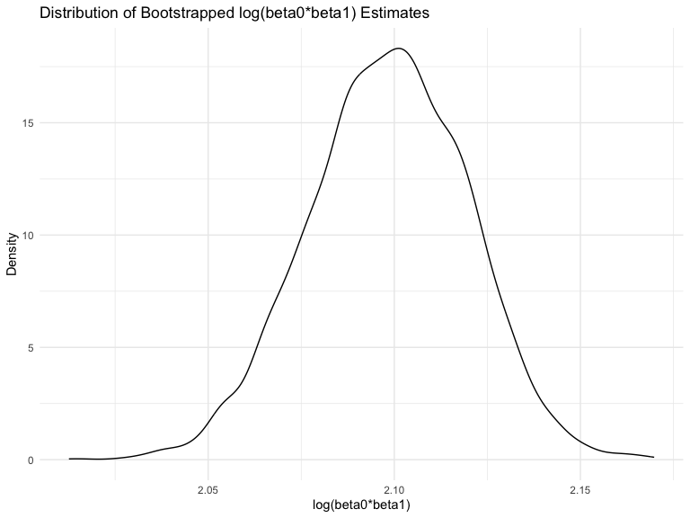
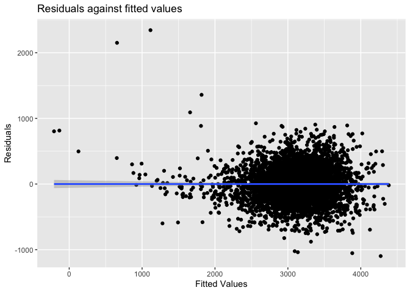

p8105_hw6_jl6647
================
Jiatong Li
2023-11-18

``` r
library(tidyverse)
```

    ## ── Attaching core tidyverse packages ──────────────────────── tidyverse 2.0.0 ──
    ## ✔ dplyr     1.1.3     ✔ readr     2.1.4
    ## ✔ forcats   1.0.0     ✔ stringr   1.5.0
    ## ✔ ggplot2   3.4.3     ✔ tibble    3.2.1
    ## ✔ lubridate 1.9.2     ✔ tidyr     1.3.0
    ## ✔ purrr     1.0.2     
    ## ── Conflicts ────────────────────────────────────────── tidyverse_conflicts() ──
    ## ✖ dplyr::filter() masks stats::filter()
    ## ✖ dplyr::lag()    masks stats::lag()
    ## ℹ Use the conflicted package (<http://conflicted.r-lib.org/>) to force all conflicts to become errors

``` r
library(dplyr)
library(broom)
library(boot)
library(modelr)
```

    ## 
    ## Attaching package: 'modelr'
    ## 
    ## The following object is masked from 'package:broom':
    ## 
    ##     bootstrap

``` r
library(mgcv)
```

    ## Loading required package: nlme
    ## 
    ## Attaching package: 'nlme'
    ## 
    ## The following object is masked from 'package:dplyr':
    ## 
    ##     collapse
    ## 
    ## This is mgcv 1.9-0. For overview type 'help("mgcv-package")'.

``` r
library(readxl)
```

Problem 2

``` r
weather_df = 
  rnoaa::meteo_pull_monitors(
    c("USW00094728"),
    var = c("PRCP", "TMIN", "TMAX"), 
    date_min = "2022-01-01",
    date_max = "2022-12-31") |>
  mutate(
    name = recode(id, USW00094728 = "CentralPark_NY"),
    tmin = tmin / 10,
    tmax = tmax / 10) |>
  select(name, id, everything())
```

    ## using cached file: /Users/denglunlaopoyeyeye/Library/Caches/org.R-project.R/R/rnoaa/noaa_ghcnd/USW00094728.dly

    ## date created (size, mb): 2023-10-17 14:50:07.395932 (8.534)

    ## file min/max dates: 1869-01-01 / 2023-10-31

### bootstrap function

``` r
set.seed(1)
boot_sample = function(weather_df) {
  sample_n(weather_df, size = nrow(weather_df), replace = TRUE)
}
```

### 5000 bootstrap samples

``` r
boot_strap = weather_df |>  
  modelr::bootstrap(n = 5000) |> 
  mutate(
    mods = map(strap, ~lm(tmax ~ tmin + prcp, data = .x)),
    mods_beta = map(mods, broom::glance),
    mods_r2 = map(mods, broom::tidy)) |> 
  unnest(mods_r2, mods_beta) |> 
  dplyr::select(.id, term, estimate, r.squared) |> 
  pivot_wider(names_from = term, values_from = estimate) |> 
  rename(
    beta_0 = `(Intercept)`,
    beta_1 = tmin,
    beta_2 = prcp) 
```

    ## Warning: `unnest()` has a new interface. See `?unnest` for details.
    ## ℹ Try `df %>% unnest(c(mods_r2, mods_beta))`, with `mutate()` if needed.

``` r
res = boot_strap |> 
  summarise(r.squared = r.squared,
    log_beta12 = log(beta_1 * beta_2),
    log_beta01 = log(beta_0 * beta_1))
```

    ## Warning: There was 1 warning in `summarise()`.
    ## ℹ In argument: `log_beta12 = log(beta_1 * beta_2)`.
    ## Caused by warning in `log()`:
    ## ! NaNs produced

    ## Warning: Returning more (or less) than 1 row per `summarise()` group was deprecated in
    ## dplyr 1.1.0.
    ## ℹ Please use `reframe()` instead.
    ## ℹ When switching from `summarise()` to `reframe()`, remember that `reframe()`
    ##   always returns an ungrouped data frame and adjust accordingly.
    ## Call `lifecycle::last_lifecycle_warnings()` to see where this warning was
    ## generated.

### CI for r-squared and log

``` r
# calculate CI for r-squared and log
r2_ci = 
  quantile(pull(res,r.squared), probs = c(0.025,0.975)) |> 
  knitr::kable()

log_ci = 
  quantile(pull(res,log_beta01), probs = c(0.025,0.975)) |>  
  knitr::kable()
  
r2_ci
```

|       |         x |
|:------|----------:|
| 2.5%  | 0.8885495 |
| 97.5% | 0.9406812 |

``` r
log_ci
```

|       |        x |
|:------|---------:|
| 2.5%  | 2.055008 |
| 97.5% | 2.138300 |

### Distribution Plots

``` r
r2_dist = res |> 
  ggplot(aes(x = r.squared)) +
  geom_density() +
  labs(title = "Distribution of Bootstrapped R-squared Estimates", x = "R-squared", y = "Density")
r2_dist
```

<!-- -->

This plot is a density plot of bootstrapped R-squared estimates. The
distribution of the R-squared values is unimodal and shows a peak around
0.92, indicating that the majority of the bootstrapped samples have an
R-squared value close to this number. Also, the distribution is slightly
skewed to the left, but is approximately as normal distribution.

``` r
b1b2_dist = res |> 
  ggplot(aes(x = log_beta12)) +
  geom_density() +
  labs(title = "Distribution of Bootstrapped log(beta1*beta2) Estimates", x = "log(beta1*beta2)", y = "Density")
b1b2_dist
```

    ## Warning: Removed 3361 rows containing non-finite values (`stat_density()`).

<!-- -->

This plot is a density plot of bootstrapped Log Beta Product estimates.
The distribution appears to be left-skewed, which may be caused by the
`NA` generated during the logarithm calculation.

``` r
b0b1_dist = res |> 
  ggplot(aes(x = log_beta01)) +
  geom_density() +
  labs(title = "Distribution of Bootstrapped log(beta0*beta1) Estimates", x = "log(beta0*beta1)", y = "Density")
b0b1_dist
```

<!-- -->

This plot is also a density plot of bootstrapped Log Beta Product
estimates. It follows the normal distribution.

Problem 3

``` r
birthweight = read_csv("birthweight.csv")
```

    ## Rows: 4342 Columns: 20
    ## ── Column specification ────────────────────────────────────────────────────────
    ## Delimiter: ","
    ## dbl (20): babysex, bhead, blength, bwt, delwt, fincome, frace, gaweeks, malf...
    ## 
    ## ℹ Use `spec()` to retrieve the full column specification for this data.
    ## ℹ Specify the column types or set `show_col_types = FALSE` to quiet this message.

### Tidy the dataset

``` r
birth = 
  birthweight |> 
  janitor::clean_names() |> 
  mutate(babysex = case_when(babysex == 1 ~ 'male',
                             babysex == 2 ~ 'female'),
         frace = recode(frace, "1" = "White", "2" = "Black", "3" = "Asian", "4" = "Puerto Rican", "8" = "Other", "9" = "Unknown"),
         malform = case_when(malform == 0 ~ 'absent',
                             malform == 1 ~ 'present'),
         mrace = recode(mrace, "1" = "White", "2" = "Black", "3" = "Asian", "4" = "Puerto Rican", "8" = "Other")) |> 
  na.omit()
```

### Propose a regression model for birthweight

**First, I set all variables as predictors and do MLR**

``` r
mlr = lm(bwt ~ ., data = birth)
mlr |> 
  broom::tidy() |> 
  knitr::kable()
```

| term              |      estimate |   std.error |  statistic |   p.value |
|:------------------|--------------:|------------:|-----------:|----------:|
| (Intercept)       | -6306.8345949 | 659.2639908 | -9.5664782 | 0.0000000 |
| babysexmale       |   -28.7073088 |   8.4652447 | -3.3911966 | 0.0007021 |
| bhead             |   130.7781455 |   3.4523248 | 37.8811826 | 0.0000000 |
| blength           |    74.9535780 |   2.0216656 | 37.0751613 | 0.0000000 |
| delwt             |     4.1007326 |   0.3948202 | 10.3863301 | 0.0000000 |
| fincome           |     0.2898207 |   0.1795416 |  1.6142265 | 0.1065513 |
| fraceBlack        |    -6.9048265 |  78.8349060 | -0.0875859 | 0.9302099 |
| fraceOther        |   -16.9391876 |  97.5931709 | -0.1735694 | 0.8622120 |
| fracePuerto Rican |   -68.2323428 |  78.4692463 | -0.8695425 | 0.3845988 |
| fraceWhite        |   -21.2361118 |  69.2959907 | -0.3064551 | 0.7592729 |
| gaweeks           |    11.5493872 |   1.4653680 |  7.8815609 | 0.0000000 |
| malformpresent    |     9.7649680 |  70.6258929 |  0.1382633 | 0.8900388 |
| menarche          |    -3.5507723 |   2.8950777 | -1.2264860 | 0.2200827 |
| mheight           |     9.7874130 |  10.3115672 |  0.9491683 | 0.3425881 |
| momage            |     0.7593479 |   1.2221417 |  0.6213256 | 0.5344182 |
| mraceBlack        |   -60.0487959 |  80.9532075 | -0.7417717 | 0.4582660 |
| mracePuerto Rican |    34.9078811 |  80.9480792 |  0.4312379 | 0.6663169 |
| mraceWhite        |    91.3866079 |  71.9189677 |  1.2706885 | 0.2039079 |
| parity            |    95.5411137 |  40.4792711 |  2.3602479 | 0.0183069 |
| pnumlbw           |            NA |          NA |         NA |        NA |
| pnumsga           |            NA |          NA |         NA |        NA |
| ppbmi             |     4.3537865 |  14.8913292 |  0.2923706 | 0.7700173 |
| ppwt              |    -3.4715550 |   2.6121254 | -1.3290155 | 0.1839131 |
| smoken            |    -4.8543629 |   0.5870549 | -8.2690107 | 0.0000000 |
| wtgain            |            NA |          NA |         NA |        NA |

**I make a plot of model residuals against fitted values**

``` r
birth |> 
    add_predictions(mlr) |>  
    add_residuals(mlr) |> 
    ggplot(aes(x = pred, y = resid)) +
    geom_point()  + 
    geom_smooth(method = "lm") + 
    labs(title = "Residuals against fitted values", 
       x = "Fitted Values", 
       y = "Residuals")
```

    ## Warning in predict.lm(model, data): prediction from rank-deficient fit; attr(*,
    ## "non-estim") has doubtful cases

    ## Warning in predict.lm(model, data): prediction from rank-deficient fit; attr(*,
    ## "non-estim") has doubtful cases

    ## `geom_smooth()` using formula = 'y ~ x'

<!-- -->

From the plot it is clear to see that the slope is 0, so we need to
select predictors in order to measure the relationship

**Compare your model to two others: One using length at birth and
gestational age as predictors (main effects only), One using head
circumference, length, sex, and all interactions (including the
three-way interaction) between these**

``` r
# model comparison 1
model_bg = lm(bwt ~ blength + gaweeks, data = birth) |> 
  broom::tidy() |> 
  knitr::kable()

# model comparison 2
model_bbb = lm(bwt ~ bhead * blength * babysex, data = birth) |> 
  broom::tidy() |> 
  knitr::kable()
```
